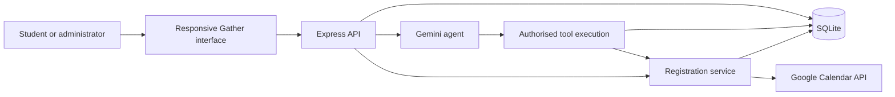
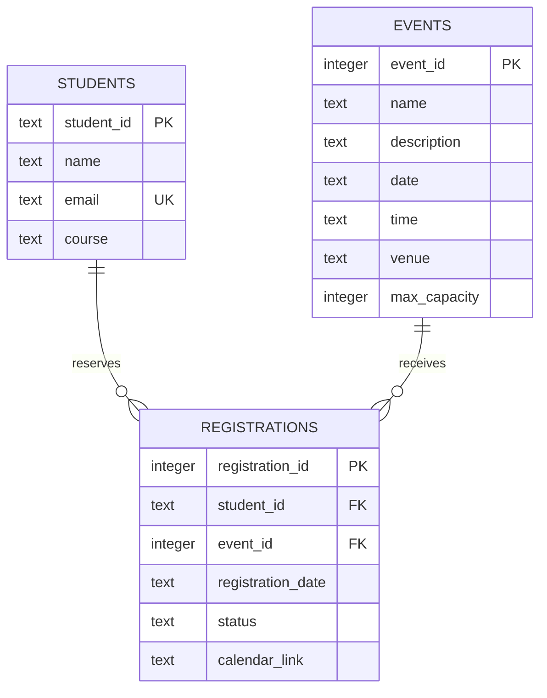

# Gather: AI-Powered Campus Event Management System

## Abstract

Gather centralises campus event discovery and registration in a full-stack application. Students browse events, reserve seats and manage their schedules; administrators create events and monitor attendance. A Gemini-based agent uses function calling to retrieve database information and execute registration actions. Google Calendar integration creates invitations, while local calendar downloads preserve usefulness when the external service is unavailable.

## Problem and objectives

Manual registration through messages or spreadsheets fragments event information, obscures seat availability and makes duplicate entries difficult to manage. Gather offers a single event catalogue, capacity-aware registration, participant tracking and conversational access to the same underlying data.

Objectives: maintain persistent records, provide student/admin access, enforce capacity and uniqueness, expose CRUD operations, execute meaningful AI tool actions, integrate a Google API and support a demonstrable browser interface.

## Technology

| Layer | Technology | Responsibility |
|---|---|---|
| Frontend | HTML, CSS, JavaScript | Responsive views, validated forms, API communication |
| Backend | Node.js, Express | Access control, validation, application API |
| Database | SQLite, better-sqlite3 | Students, events, registrations, sessions, OAuth states |
| AI | Gemini generateContent and function declarations | Natural language reasoning and tool selection |
| Integration | Google Calendar API, OAuth 2.0 | Organiser calendar event and attendee invitation |
| Tests | Node test runner, Playwright | API workflows and browser journeys |

## Architecture

All frontend data mutations go through the backend. The agent cannot bypass role checks in its tools. REST registration and AI registration share the service implementation.

## Data model

The student/event pair is unique. Cancellation retains a record and releases capacity. Rebooking restores its confirmed state. Event deletion cascades to registrations. Sessions store an expiring random token and user identity; OAuth states are short-lived and bound to a browser cookie.

## Principal workflows

### Registration

Authenticate the student, retrieve the event, reject a confirmed duplicate, check capacity and event timing, insert or reactivate a registration, then attempt Google Calendar creation. Return registration success independently of calendar success. SQLite queries execute synchronously in a single Node process; multi-process deployment would require a stronger transaction strategy.

### Agent

The backend supplies user role and current date to Gemini. The model requests declared functions; the executor retrieves authoritative application data or registers the authenticated student. Function results return to the model for a user-facing response. The loop is bounded to five model requests; each fetch has a 25-second timeout. Client-provided history is limited to eight text entries and does not determine user identity.

When credentials are absent, a clearly labelled deterministic demo assistant handles predefined intent patterns. This mode demonstrates database-backed actions but does not fulfil the LLM requirement by itself.

### External API

An administrator requests a Google OAuth URL. The backend generates an expiring random state and HttpOnly cookie. Callback validation consumes the state before token exchange. Tokens stay on the server. Confirmed registration attempts a Calendar API insertion with event start/end, venue and attendee information.

## API overview

| Endpoint | Purpose | Access |
|---|---|---|
| POST /api/login | Create session | Public |
| GET /api/me; POST /api/logout | Session lifecycle | Authenticated |
| GET /api/events; GET /api/events/:id | Browse events | Authenticated |
| POST /api/events; PUT/DELETE /api/events/:id | Event CRUD | Administrator |
| POST /api/events/:id/register | Reserve seat | Student |
| GET /api/my-registrations | Schedule | Student |
| DELETE /api/my-registrations/:id | Cancel own seat | Student |
| GET /api/events/:id/participants | Guest list | Administrator |
| DELETE /api/registrations/:id | Cancel participant | Administrator |
| GET /api/stats | Aggregates | Administrator |
| POST /api/agent | Agent request | Authenticated |
| GET /api/integrations | Configuration indicators | Authenticated |
| POST /api/calendar/connect | Initiate OAuth | Administrator |

## Validation and safeguards

Role guards protect administrative mutations and student-only actions. Registration cancellation checks ownership. Event fields have length limits; date/time and integer capacity are validated. Capacity cannot be reduced below active registrations. SQLite uses parameterised queries and foreign keys. The frontend escapes dynamic strings, reports errors and disables repeated form submission. CSV cells escape quotes and prefix formula-leading characters. Secrets and data files are excluded from version control.

## Evaluation

Automated API tests cover authorization, invalid dates/times, event CRUD, duplicate prevention, full capacity, cancellation ownership, rebooking, agent actions, OAuth guards and logout revocation. Browser tests cover student login, filters/search, assistant results, calendar downloads, persisted login, mobile overflow and administrator CRUD. Live Gemini and Calendar checks require user-provided credentials and must be demonstrated separately.

## Limitations and future development

This is an academic prototype: student-ID identification, a shared administrator password and example student emails are appropriate for a controlled demo. Production improvements include institution SSO, account onboarding, rate limiting, cookie-based sessions, audit logs, secure token storage, OAuth per organiser, cancellation synchronization, a waitlist, QR attendance, notifications, recurrence, accessibility audit and transactional concurrency across multiple application instances. Category labels currently derive from event names. Charts reflect real local registrations, not fabricated analytics.

## Conclusion

Gather combines a complete application workflow with an actionable agent and an external API integration. Its separation between presentation, API, shared business logic and persistent storage supports explanation, testing and future expansion. A final-year presentation should include both the local workflows and actual configured Gemini/Google API execution.
